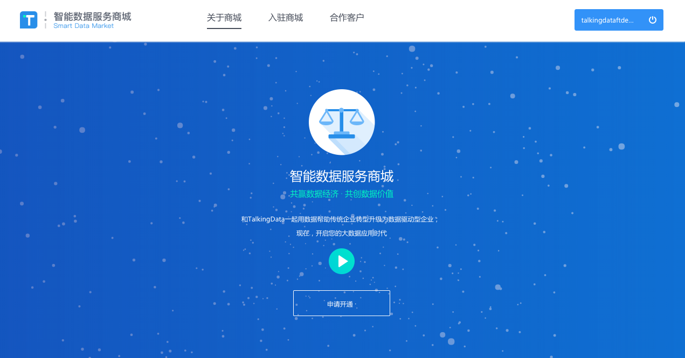
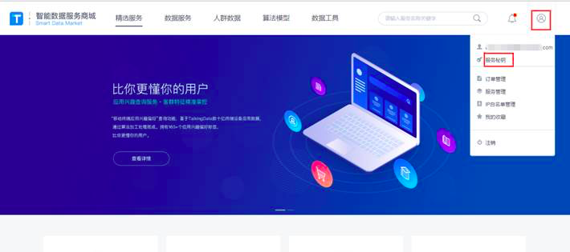
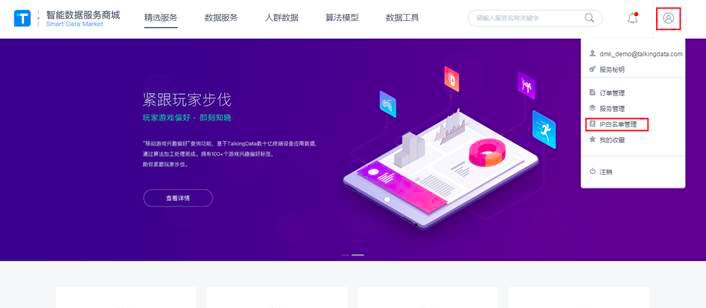
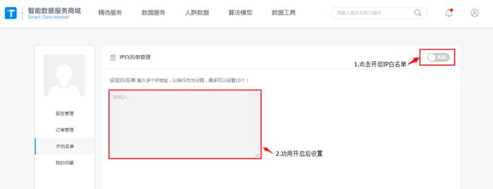

## 申请开通TalkingData智能数据服务商城
> **用TalkingData账户登陆TalkingData智能数据服务商城.访问以下地址进行登陆： 点击去登陆https://sdmk.talkingdata.com/#!/login
> **申请开通TalkingData智能数据服务，如下图所示：
> **
> **申请之后，进入待开通状态，如下图所示：
> **
## 获取TalkingData智能数据商城访问appkey与apitoken
> **在个人中心获取（右上角个人图标点击弹出，“服务密钥”点击可复制）查看，如下图所示：
> **
## 设置TalkingData智能数据商城IP白名单，IP白名单默认为关闭状态，请尽快设置白名单IP以免因此产生不必要的损失，如下图所示：
> **
> **